# Azure DevOps CI/CD pipeline for ASP.NET Core application
Two months ago [Scott Hanselman](https://www.hanselman.com/) wrote a nice [blog post](https://www.hanselman.com/blog/AzureDevOpsContinuousBuildDeployTestWithASPNETCore22PreviewInOneHour.aspx) where he describes how to use [Azure DevOps](https://azure.microsoft.com/en-us/services/devops/) to build/deploy/test an ASP.NET Core application.

My goal here is to extend Scott's configuration by using [Docker](https://www.docker.com/) containers and by adding a pipeline stage for running acceptance tests with [Selenium](https://www.seleniumhq.org/). I'll use one of my ASP.NET Core sample applications [E-BikesShop](https://ebikesshopserver.azurewebsites.net/retailcalculator) which implements a simple retail calculator. 

Having E-BikesShop application [GitHub repository](https://github.com/stonemonkey/BlazorInAction) I'd like to automate the following CI/CD process on it:
*   Each time a push is made to the GitHub master branch a build will be triggered.
*   The build will fail on red unit tests. A report/visualization should be made available.
*   A successful build will create a Docker image and push it to an Azure Container Repository.
*   The image will be deployed to an Azure App Service instance.
*   A successfull deployment will trigger acceptance tests with [Selenium](https://www.seleniumhq.org/). A report/visualization should be made available.
*   ~~In case of red/failed acceptance tests, redeploy last successfull release image.~~

Before jumping into the CI/CD pipeline configuration I need to prepare the following: 
*   A Microsoft Azure account. Create a free* one [here](https://azure.microsoft.com/en-us/free/?v=18.45).
*   Azure CLI. Install locally from [here**](https://docs.microsoft.com/en-us/cli/azure/install-azure-cli?view=azure-cli-latest).
*   ~~VSTS CLI. Install locally from [here**](https://docs.microsoft.com/en-us/cli/vsts/install?view=vsts-cli-latest).~~
*	Docker. Install locally from [here**](https://www.docker.com/get-started).
 
(*) Read carefully what you can do with the free account. Even it's "free" it may involve some costs in certain conditions at some point.

(**) Don't forget to add the paths to the Azure CLI and Docker executables in Path environment variable so that you can run them from the console.

## Setting up Azure Resources for hosting the app
Since this is a .NET application it makes sense for me to host it in Azure. However, I decided to use Docker for packaging the parts of deployment because nowadays it looks like a standard way supported by all major cloud platforms. If I want in the future to try another cloud platform it should be easy to switch. So here I am to try it out.

For the moment E-BikesShop's client web UI and its backend API are hosted in the same ASP.NET Core application. This means they'll share the same Docker container for which I need an [Azure Container Registry](https://azure.microsoft.com/en-us/services/container-registry/) to store the Docker image and an [Azure App Services for containers](https://azure.microsoft.com/en-us/services/app-service/containers/) to host the application Docker container. Possibly later I'll add a SQL database in a separated container.

Working my way through the documentation I found it easyer to use the console (cmd/bash) for setting up Azure Resources. So I open my favorite console, change directory to the locally cloned [GitHub repository](https://github.com/stonemonkey/BlazorInAction) folder and run the following Azure CLI commands.

1. First I need to create the Azure Resource group that will glue together the image and the service: 
```batch
az group create -n BlazorInAction -l northeurope
```

`BlazorInAction` is the name of the GitHub repository and I'll continue using this as an 'aggregator' name for all resurces of the E-BikesShop application.

2. Then I can create the Azure Container Registry, with adminstration enabled (--admin-enabled) because I'll need access to push the image later:
```batch
az acr create -g BlazorInAction -n EBikesShopServer --sku Basic --admin-enabled true
```

3. And an Azure Service Plan, needed for the App Service to define the capabilities and pricing tire:
```batch
az appservice plan create -g BlazorInAction -n BlazorInActionPlan -l northeurope --sku B1 --is-linux
```

4. And finaly I can create a Linux (--is-linux) Azure App Service host with the group and the plan from the previous steps:
```batch
az appservice plan create -g BlazorInAction -n BlazorInActionPlan -l northeurope --sku B1 --is-linux
```

At this moment browsing the BlazorInAction resources group page in Azure portal shows this:

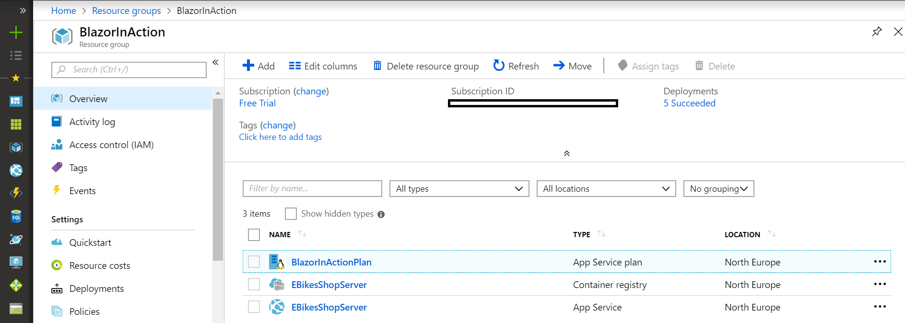

## Build, unit tests and run the application inside a local Docker container (manually)
This operations are going to be automated later by the Azure DevOps build but for the moment I want to run them manually to prove each one works as expected. 

Before starting the application I need a Docker image which is the blueprint of my container. The instructions to create the image are written in a Dockerfile, in my case [build.dockerfile](https://github.com/stonemonkey/BlazorInAction/blob/master/build.dockerfile) which tells Docker to copy all files from the current directory into the container `/src` directory on top of a base image (`microsoft/dotnet:sdk`), then to run dotnet core build, test and publish commands and to expose the application on port `80`. Beside the .NET Core runtime, the sdk base Docker image contains all the tools needed to build an .NET Core application. 

1. Build the Docker image locally:
```batch
docker build -f build.dockerfile -t ebikesshopserver.azurecr.io/stonemonkey/blazorinaction:initial .
```
Use `docker images` command to see all local cached images. The output should contain `ebikesshopserver.azurecr.io/stonemonkey/blazorinaction` repository with `initial` tag.

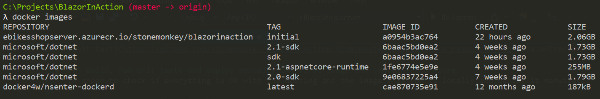

2. Run the image locally in the background (`-d`), mapping the ports (`-p`) and removing it on stop (`--rm`):
```batch
docker run --name ebikesshop -p 8080:80 --rm -d ebikesshopserver.azurecr.io/stonemonkey/blazorinaction:initial
```
Use `docker ps` command to see all local containers running. The output should contain `ebikeshop` container with status `Up ...` and ports `0.0.0.0:8080->80/tcp`. The ports column is showing the mapping of the local host 8080 port to the container 80 port.

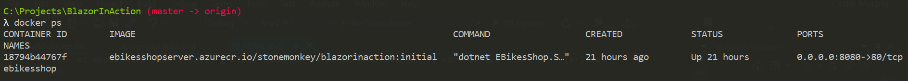

At this moment the application should be accessible in browser at http://localhost:8080.

4. Copy the dotnet build output directory from the container to the local machine:
```batch
docker cp ebikesshop:src/EBikesShop.Server/out .
```
The content of the `./out` directory should look like in the next picture.

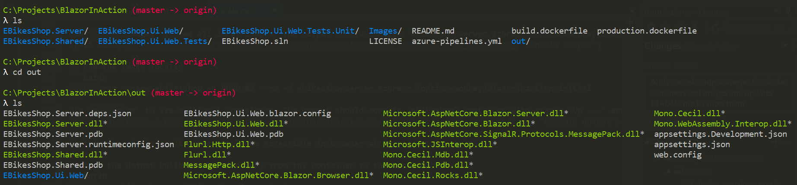

5. Now, I can stop the container:
```batch
docker stop ebikesshop
```
Using `docker ps --all` should't show anymore the container `ebikesshop`. It was stopped and removed (remember `--rm` option from docker run command). 

6. Build Docker production image:
```batch
docker build -f production.dockerfile -t ebikesshopserver.azurecr.io/stonemonkey/blazorinaction:initial .
```
Again the instructions are in a Dockerfile, now called [production.dockerfile](https://github.com/stonemonkey/BlazorInAction/blob/master/production.dockerfile). This time I'm using a runtime base image (`microsoft/dotnet:aspnetcore-runtime`) which is optimized for production environments and on top of it I'm copying local `./out` directory containing the dotnet build output from a previous step. Again port `80` is exposed and the entry point is set to the assembly responsible to start the application.

Using `docker images` command I should still see the image in the list but the size should be much smaller now (hundreds of MBs, instead of GBs).

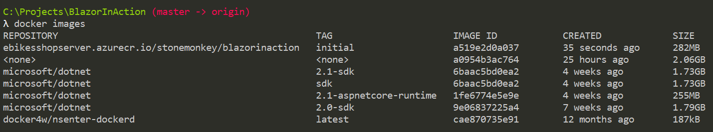

## Deploying the first image and container to Azure (manually)
This steps are going to be automated later by an Azure DevOps Release stage named `Deploy`.

1. Obtain credentials to access the Azure Container Registry:
```batch
az acr credential show -n EBikesShopServer
```

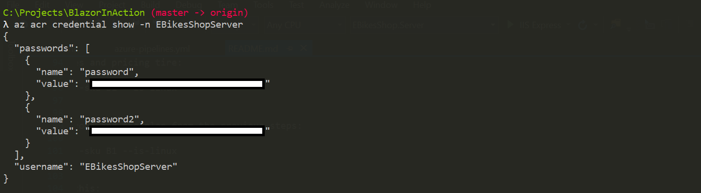

2. Login to the Azure Container Registry with the username and one of the password obtained in the previous step:
```batch
docker login https://ebikesshopserver.azurecr.io -u EBikesShopServer -p <password>
```

3. Push Docker image into the Azure Container Registry:
```batch
docker push ebikesshopserver.azurecr.io/stonemonkey/blazorinaction:initial
```
This is taking some time depending how big the image is.

4. Configure Azure Service to use the image I just pushed:
```batch
az webapp config container set -g BlazorInAction -n EBikesShopServer --docker-custom-image-name ebikesshopserver.azurecr.io/stonemonkey/blazorinaction:initial --docker-registry-server-url https://ebikesshopserver.azurecr.io -p EBikesShopServer -p <password> 
```
At this moment I can browse the application hosted in Azure https://ebikesshopserver.azurewebsites.net/.

## Seting up Azure DevOps Project
In order to automate a CI/CD pipeline in Azure I need to create an account and sign in to the [Azure DevOps](https://azure.microsoft.com/en-us/services/devops/). I used my Microsoft Account credentials to authenticate.

I gave up to VSTS CLI console approach because I couldn't find a full CLI path to achieve what I wanted and it felt wrong to mix console commands with actions in the portal UI for the same use case.
~~For being able to use VSTS CLI command in console I need to create a Personal Access Token (click on the user avatar from the top right corner of the page, then select Security and + New Token). As a result the portal gives me token which I must save locally safe for further authorisation agains VSTS API. This is not needed if I'll use the portal for setting up the pipeline.~~

Then I create a new public project (BlazorInAction) for Git with Agile process even I'm not planning to use the Bords, Repos, Test Plans and Artifacts features.

## Adding Azure DevOps GitHub and Resource Manager connections
Before creating the build pipeline I need to setup a connection to GitHub for fetching the sources. I go to Project settings -> Pipelines -> Service connections -> New service connection and select GitHub.


I name the connection `stonemonkey` and save it performing the authorization.

In order to connect to the Azure Resource Manager for pushing Docker images to Azure Container Registry I need a Resource Manager Connection.

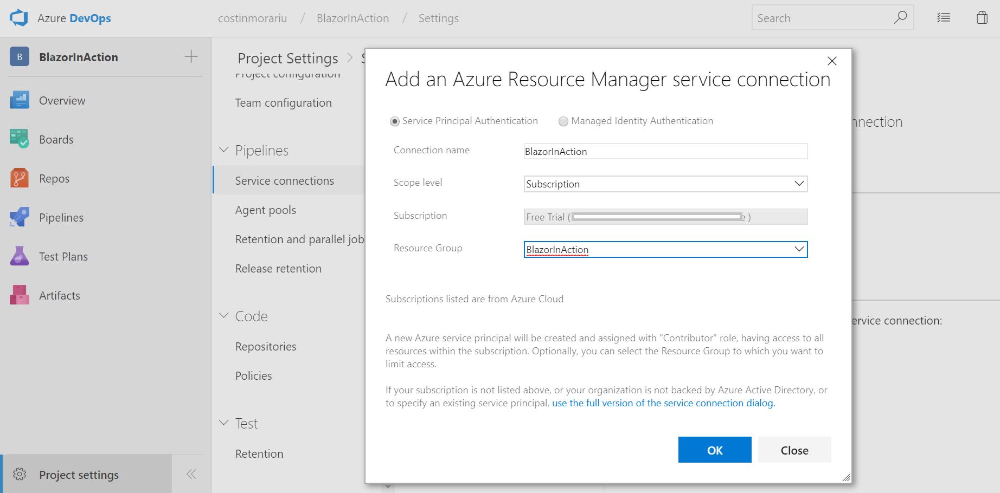

## Creating the Azure DevOps Build pipeline
Azure DevOps Pipelines automate their CI/CD Pipelines interpreting [YAML](https://docs.microsoft.com/en-us/azure/devops/pipelines/yaml-schema?view=vsts&tabs=schema) templates. Basically the instructions for the automations are writen in a file named [azure-pipelines.yml](https://github.com/stonemonkey/BlazorInAction/blob/master/azure-pipelines.yml) from the root folder of the repository. All the commands I run manually in the previous sections (and more) are present in this file.

It's time to add my build pipeline.

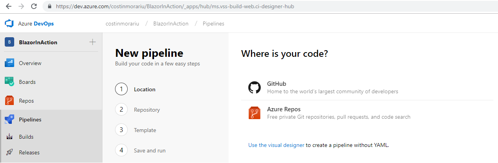

I select GitHub and use my existing `stonemonkey` connection.

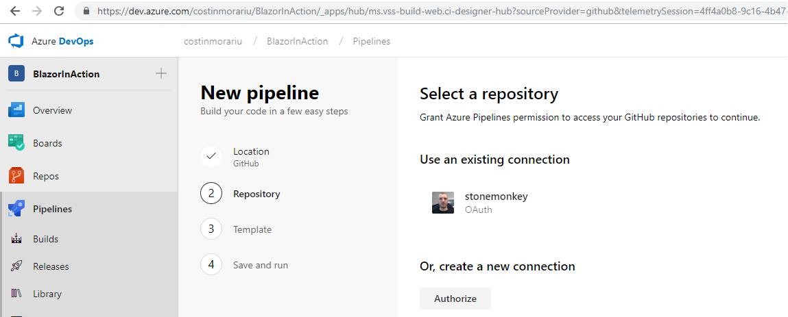

Then I select my GitHub repository, review the azure-pipeline.yml file and press Run.

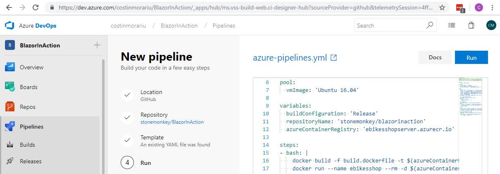

Now Azure DevOps finds a pool and an agent. Then it starts to run the tasks described in my azure-pipeline.yml file. If everything is OK all tasks are green.

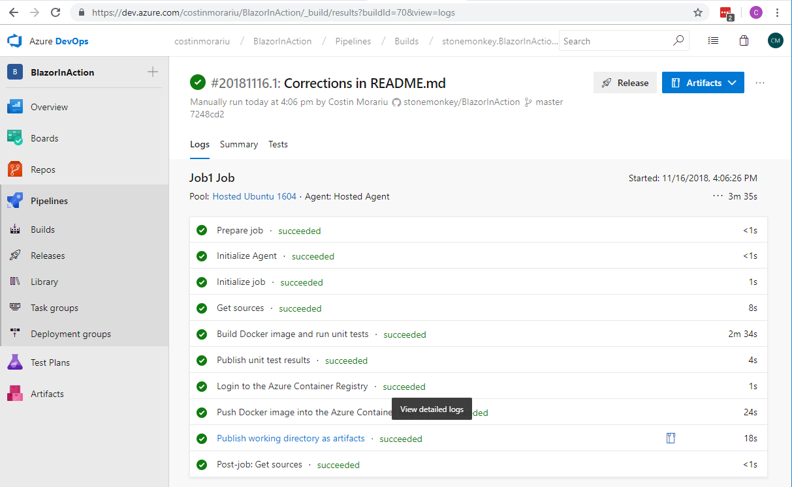

I can click on any to see their console log output.

## Creating the Azure DevOps Release Deploy stage
In Azure Pipelines deployments are handled within the release jobs. I can start adding one by pressing Release button on top right corner of a particular build instance page. The last step from the previous section related creating the build pipeline just landed me there, so I go on select and Apply `Azure App Service deployment` template.

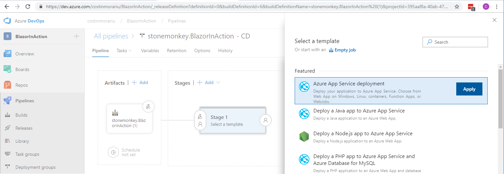

I rename the stage to `Deploy` and click on `1 job, 1 task` link to edit job and task details.

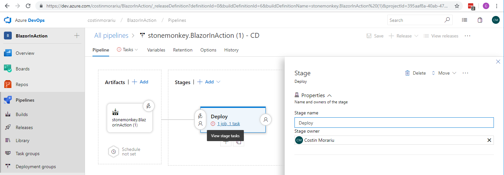

Now the page asks me to fill some parameters that will be shared among all the tasks of the pipeline. I just skip this by selecting `Unlink all` and confirming the operation.

Then I select `Deploy Azure App Service` task and fill the following fields:
*   Version dropdown: `4.* (preview)`
*   Display name input: `Deploy EBikesShopServer image`
*   Azure subscription dropdown: `BlazorInActionConnection`, this is the connection I added in a previous section for being able to push Docker image with Azure Resource Manager.
*   App Service type dropdown: `Web App for Containers (Linux)`
*   App Service name dropdown: `EBikesShopServer`, this is the Azure App Service I added up in one of the first sections.
*   Registry or Namespace input: `ebikesshopserver.azurecr.io`, this is the unique name of the Azure Registry Container configured up in one of the first sections.
*   Image input: `stonemonkey/blazorinaction`, this is the name of the repository where the images are stored.
*   Startup command input: `dotnet EBikesShop.Server.dll`

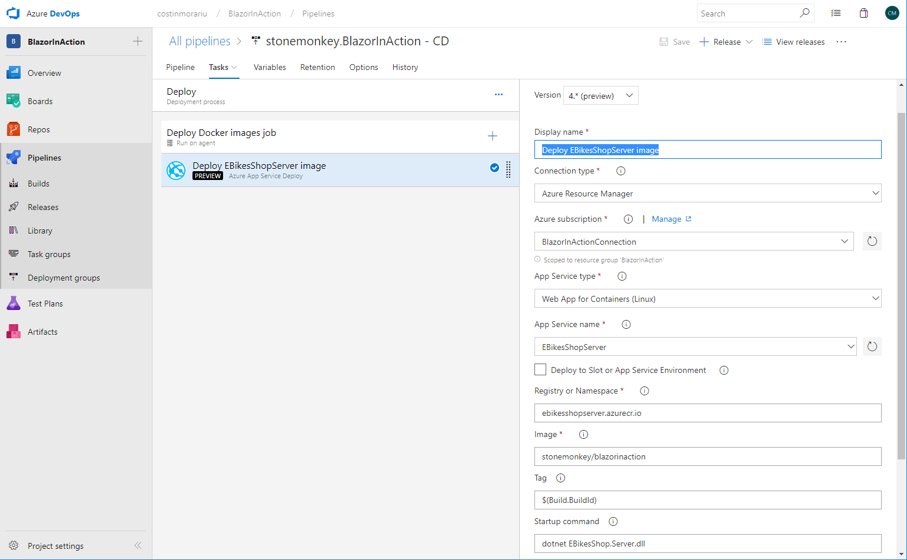

At this moment the pipeline looks like this:

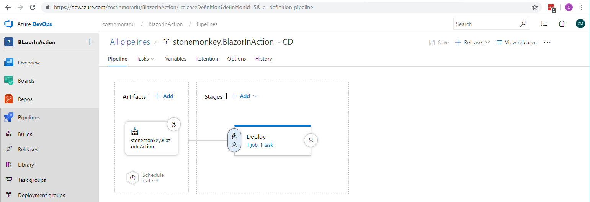

And I can manually start a build and a deploy by pressing `+ Release` button in the top right corner of the page. Or I can push into the master branch of my repository which will trigger the pipeline automatically. 

## Creating the Azure DevOps Release QA stage
Now I want to add a new stage to the pipeline which will run my Selenium acceptance tests.

In the Stages box I select the Deploy stage and click `+ Add` followed by `+ New stage`. Then I click on the `Empty job` link and rename the stage to `Run QA`. Again, I click on the `1 job, 0 tasks` link and select the `Agent job` job. Then I rename it to `Run Acceptance tests job` and make sure Agent pool is set to `Hosted VS2017`. This will run my tasks in an environment containing (among other stuff) Visual Studio 2017 Build Tools and Selenium Chrome driver which are needed to run my acceptance tests.

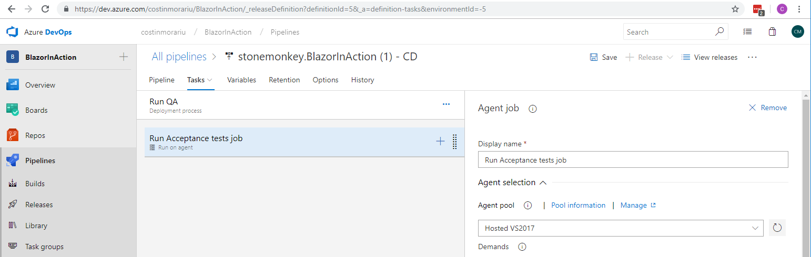

I press `+` button on the job, add `.NET Core` task and fill the fieds:
*   Display name input: `dotnet test`
*   Command dropdown: `test`
*   Path to project(s): `stonemonkey.BlazorInAction\Ui.Web.Tests\EBikesShop.Ui.Web.Tests\EBikesShop.Ui.Web.Tests.csproj`, I only have one test project for the moment.
*   Arguments: `-c Release`, although the task will not rebuild the project, I need to specify the configuration so that `dotnet test` command picks the right already buit assemblies.
*   Check `Publish test results and code coverage` checkbox.

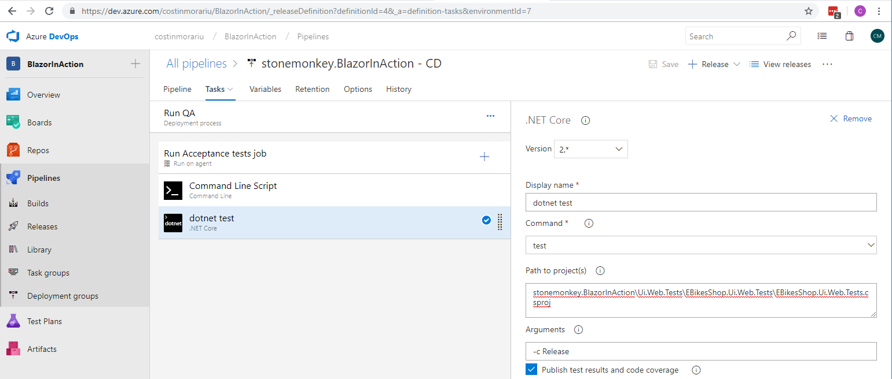

For debugging purpose I used a `Command Line Script` task to print in the log console certain things like content of folder for example. This kind of task can be placed before and/or after any task to check its input or output states.

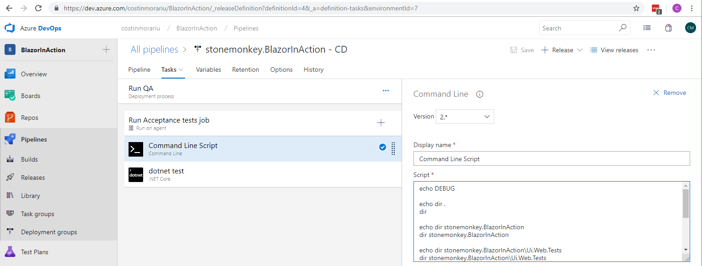

The pipeline looks like this now:


The CI/CD pipeline dashboard is accessible [here](https://dev.azure.com/costinmorariu/BlazorInAction/_dashboards/dashboard/a235a86e-f670-4789-8d22-1a35dcb022c2?fullScreen=true).

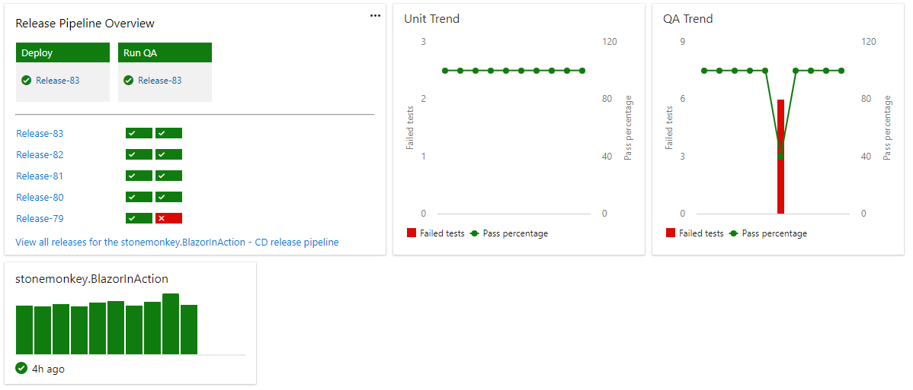

Now I a have a decent CI/CD pipeline that builds, tests and deploys my E-BikesShop sample application.
