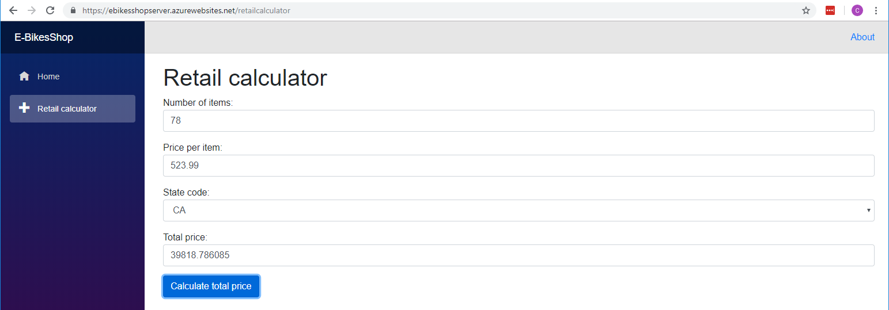

# Blazor application built, tested, deployed with Azure Pipelines

This is a sample application I used to poke into [Blazor](https://blazor.net/) and to catch up with [Azure DevOps pipelines](https://azure.microsoft.com/en-us/services/devops/pipelines/). 

As expected, basic CRUD with [Blazor](https://blazor.net/) felt straight forward. 

On the other hand, I spend some time digging into YAML, Docker, Azure and Azure DevOps to setup a decent cloud CI/CD pipeline for this project. 

To run the code locally (Windows or Mac), clone this repository, build and debug in [Visual Studio 2017](https://visualstudio.microsoft.com/downloads/) (15.8.0 or higher). By default it's set to start in IISExpress.

At the time of writing [Blazor](https://github.com/aspnet/Blazor) is an experimental .NET web framework (not ready yet to be used in production applications). Still, it looks very promissing, reason why I want to give it a try. The cool part with this framework is that it runs in the browser with [WebAssembly](https://webassembly.org/) and uses C#/[Razor](https://docs.microsoft.com/en-us/aspnet/core/mvc/views/razor?view=aspnetcore-2.1) to render HTML.

## Requirements
From [Elephant Carpaccio exercise](http://alistair.cockburn.us/Elephant+Carpaccio+exercise): 
*   Build a retail calculator that expects 3 inputs from the user (number of items, price per item and US state code) and outputs the total price of an order.
*   Consider giving discounts based on the order price ranges:

| Order price ($) | Discount rate (%)  
| --------------- | -----------------  
| >= 1000         | 3                  
| >= 5000         | 5                  
| >= 7000         | 7                  
| >= 10000        | 10                 
| >= 15000        | 15                

*   Consider the following US states for the order total price calculation:

| State code | State name | Tax rate (%)  
| ---------- | ---------- | ------------  
| UT         | Utah       | 6.85          
| NV         | Nevada     | 8.00          
| TX         | Texas      | 6.25          
| AL         | Alabama    | 4.00          
| CA         | California | 8.25          

*   ~~Add a page for visualizing/adding/removing state taxes.~~

## Outcome
The application is accessible [here](https://ebikesshopserver.azurewebsites.net/retailcalculator).

This repository contains the sources for a simple implementation of the [Elephant Carpaccio exercise](http://alistair.cockburn.us/Elephant+Carpaccio+exercise) with [Blazor](https://blazor.net/) and [ASP.NET Web API](https://www.asp.net/web-api).

The solution contains the following modules/projects:
*   EBikesShop.Server - hosts the Client and implements an HTTP API for taxes CRUD.
*   EBikesShop.Shared - implements classes used across the other projects.
*   EBikesShop.Ui.Web - implements the Client that runs in the browser.
*   EBikesShop.Ui.Web.Tests - implements Client acceptance tests.
*   EBikesShop.Ui.Web.Tests.Unit - implements Client unit tests.

[Blazor documentation, the comunity and the blog](https://blazor.net/) are very helpful resources for understanding and clarifying various aspects of the development.
